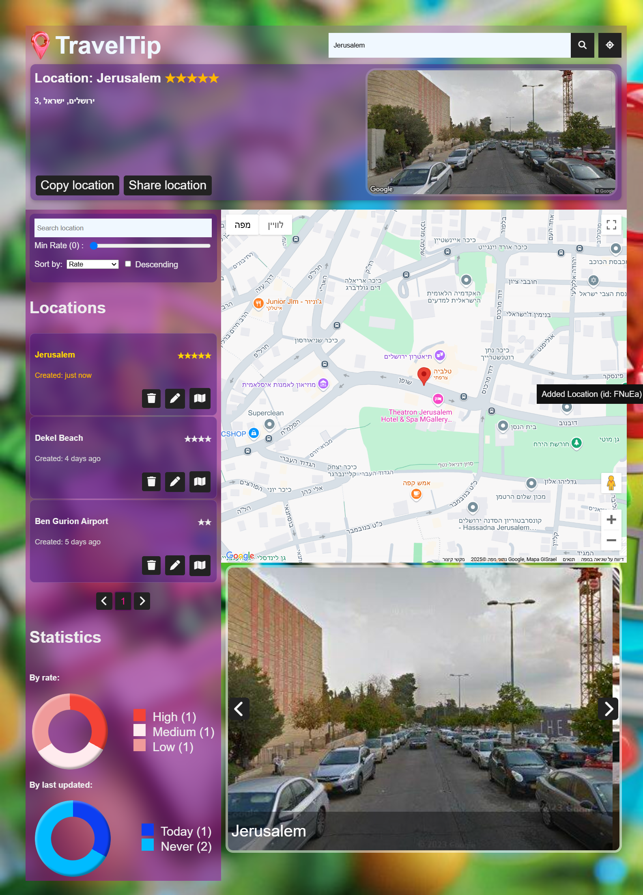

# TravelTip
#### The app that gets you somewhere

##  Table of Contents

- [Description](#description)
- [Main Features](#main-features)
- [Locations CRUDL](#locations-crudl)
- [Selected Location](#selected-location)
- [Location Format](#location)
- [Services](#services)
- [Controller](#controller)
- [Installation](#installation)
- [How to Use](#how-to-use)
- [License](#license)


## Description
TravelTip is an app designed to manage a list of your favorite locations. You can add, update, delete, and search for locations on a map, as well as share and bookmark them. The app allows users to store and organize location details and supports filtering and sorting.


## Main Features
- **Location Management:** Users can add, update, and remove locations.
- **Map Integration:** The app utilizes the Google Maps API to display locations. The map is interactive, allowing users to click to add new locations or pan and zoom by dragging or scrolling.- Location Details: Locations have associated details such as name, rating, creation, and update creation time.
- **Filter and Sort:** Locations can be filtered by text search and rating, and sorted by criteria such as name,rating and date.
- **User Position:** Users can allow the app to detect and show their position on the map.
- **Slider:** The app features an auto-scrolling slider that displays images from Google Street View. The images represent the saved locations and cycle through as the user navigates.
- **Pagination:** Locations are paginated, with easy navigation between pages.
- **query params:** The app supports query params, allowing users to share a specific URL or bookmark the page, so they can easily return to the exact page they were viewing.
- **Statistics:** Statistics of the locations according to their ranking and the date they were last edited.


## Locations CRUDL 
- Create: Click on the map to prompt for a location name and rate.
- Read: View the details of a selected location.
- Update: Update the rating and name of a location.
- Delete: Remove a location from the list.
- List: Locations are displayed in a list with options to filter and sort.

## Selected Location
- Displayed in the header
- Location is active in the list (gold color)
- Marker on the map
- Reflected in query params 
- Copy url to clipboard
- Share via Web-Share API
- Shows an image of the location from Google Street View


## Location
Here is the format of the location object:
```js
{
    id: 'GEouN',
    name: 'Dahab, Egypt',
    rate: 5,
    geo: {
      address: 'Dahab, South Sinai, Egypt',
      lat: 28.5096676,
      lng: 34.5165187,
      zoom: 11
    },
    createdAt: 1706562160181,
    updatedAt: 1706562160181
  }
  ```
## Services
```js
export const locService = {
    query,
    getById,
    remove,
    save,
    setFilterBy,
    setSortBy,
    getLocCountByRateMap,
    getLocCountByLastUpdated,
    getPageCount,
    setCurrPage
}

export const mapService = {
     initMap,
    getUserPosition,
    setMarker,
    panTo,
    lookupAddressGeo,
    addClickListener
}
```

## Controller
```js
// To make things easier in this project structure 
// functions that are called from DOM are defined on a global app object

window.app = {
    onRemoveLoc,
    onUpdateLoc,
    onSelectLoc,
    onPanToUserPos,
    onSearchAddress,
    onCopyLoc,
    onShareLoc,
    onSetSortBy,
    onSetFilterBy,
    onSaveLoc,
    oncloseModal,
    onSlide,
    onSetCurrPage,
    onPageMove,
}
```

Here is a sample usage:
```html
<button onclick="app.onCopyLoc()">Copy location</button>
<button onclick="app.onShareLoc()">Share location</button>
```


Here is the Installation section with all instructions formatted in Markdown:

md
Copy
Edit
## Installation

Install TravelTip using one of the following methods:

## Installation

Install TravelTip using one of the following methods:

### **Build from source:**

1. Clone the TravelTip repository:
    ```sh
    ❯ git clone https://github.com/Eh2409/TravelTip
    ```

2. Navigate to the project directory:
    ```sh
    ❯ cd TravelTip
    ```

3. Install the project dependencies:
    ```sh
    ❯ npm install
    ```
    Or if you're using Yarn:
    ```sh
    ❯ yarn install
    ```

4. Add your Google Maps API key:
   - Open the `map.service.js` file in the `src` directory.
   - Find the line where the `API_KEY` is defined and replace the placeholder with your actual Google Maps API key:
     ```js
     const API_KEY = 'YOUR_GOOGLE_MAPS_API_KEY_HERE';
     ```
   - If you don't have an API key, you can obtain one from the [Google Cloud Console](https://developers.google.com/maps/documentation/javascript/adding-a-google-map?hl=he).


##  How to Use

1. **Searching for an Address**
   - Enter an address in the search bar and click the magnifying glass button to search for the location.
   - The map will automatically pan to the location.


2. **Adding a Location**
   - Click on the map to add a new location.
   - You will be prompted to enter the location’s name and rate.
   - After successfully saving the location, the location's details will appear at the top of the page, where you can generate a link to the location page or share it using the available buttons.

3. **Viewing Location Details**
   - In the list of locations, find the location whose details you want to view.
   - Click the map button next to the location, a panel will open at the top of the page with the location details and a picture of it.
   - Additionally, buttons will appear that allow you to generate and share a link to the location.

4. **Updating the Location**
   - To update a location, click the pencil button next to it.
   - After clicking the pencil button, a window will open where you can update the location name and rating.

5. **Removing the Location**
   - Click the trash can button next to the location.
   - A confirmation window will appear. After confirming, the location will be deleted from your saved list.

6. **Filter and Sort Locations**
   - In the list of locations you saved, you can search for a location by name or rating.
   - You can also sort the locations by name, rating, or creation time.

7. **View the Distance Between Your Location and the Locations You Saved**
   - At the top of the page, next to the search bar, click the location-crosshairs button.
   - Confirm the option to view your location.
   - After confirmation, a breakdown of the distance separating your location from the locations you saved will appear next to each location.


## Site Preview

